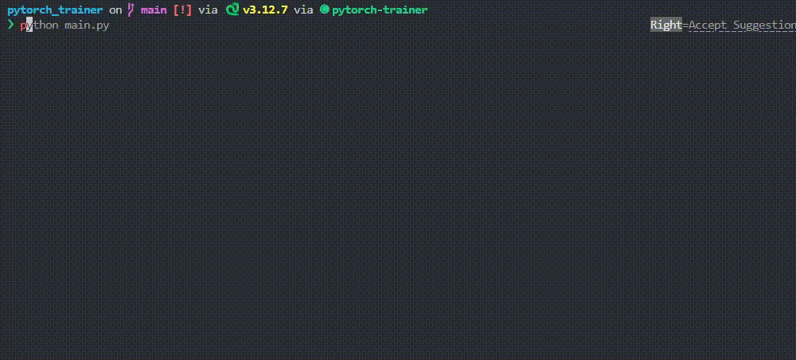

<h1 align="center">PyTorch Trainer Template</h1>

<p align="center">  </p>

This repository contains a customizable PyTorch training loop template that simplifies training, validation, and testing of models. It includes support for:
- ✅ Early stopping
- 📉 Learning rate scheduling
- 📊 Metric logging

Instead of rewriting boilerplate code for every project, use this reusable trainer as a solid starting point and adapt it to your specific needs!

## 🚀 Example

A working example using the Iris dataset, including a custom `Dataset` class and a simple FNN model, is available in `main.py`.

## 📦 Usage

### 1. Getting Started

- Copy the `trainer.py` file into your project.
- Add the packages listed in `requirements.txt` to your project environment.
- By default, your `DataLoader` should return batches as a dictionary with the following keys:
    ```python
    {'input': [...], 'target': [...]}
    ```
- Modify the `_output_parse(self, output)` function to match the output requirements of your model

### 2. Initialize the Trainer

```python
from trainer import Trainer

trainer = Trainer(model=model, device='cpu')
```

### 3. Train your model

```python
results = trainer.fit(
    train_loader=train_loader,
    val_loader=val_loader,
    optimizer=optimizer,
    criterion=criterion,
    max_epochs=100,
    early_stopping=True,
    early_stopping_monitor='accuracy',
    early_stopping_mode='max',
    metrics={
        'accuracy': sklearn.metrics.accuracy_score
    }
)
```

The `trainer.fit` function will output a dictionary containing training, validation, and test losses and metrics.

### 4. Test your model

```python
test_results = trainer.test(test_loader, criterion)
```

The `trainer.test` function will output a dictionary containing training, validation, and test losses and metrics.


### 5. Predict

```python
y_pred = trainer.predict(test_loader)
```

The `trainer.predict` function accepts both a `DataLoader` and a single input, and it outputs the predictions.

## 📄 License

This project is under the MIT license. See [LICENSE](https://github.com/ParsaD23/PyTorch_Trainer_Template/blob/main/LICENSE) for more information.